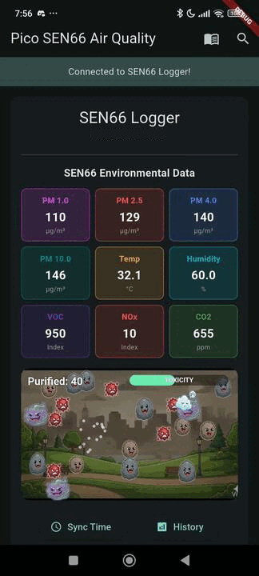
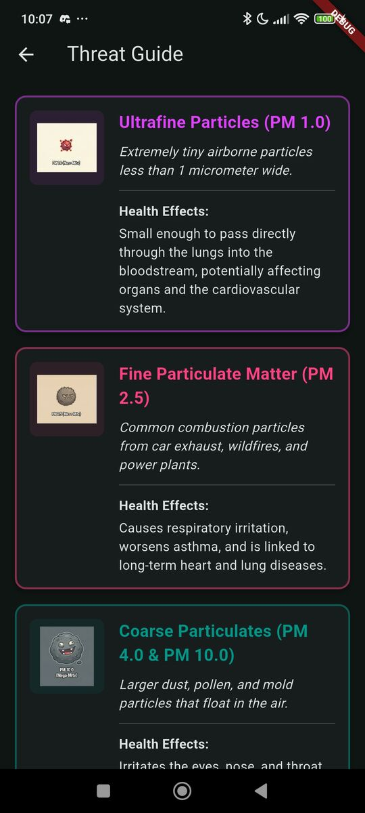
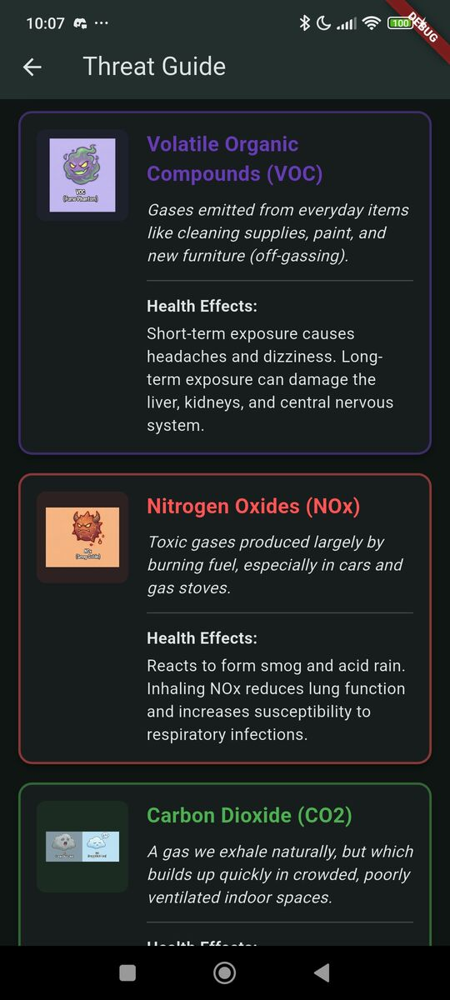
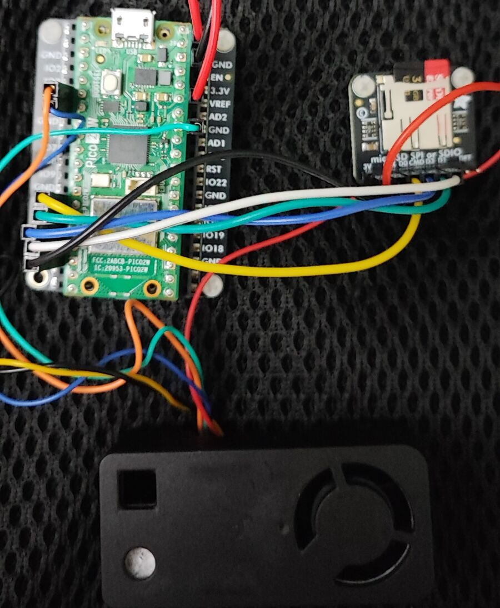

# Flutter Air Quality Game

Welcome to the **Flutter Air Quality Game** mobile app! This project bridges the gap between embedded hardware engineering and mobile gamification. It connects a Flutter mobile application to a **Raspberry Pi Pico 2W** running a **Sensirion SEN66** environmental sensor via Bluetooth Low Energy (BLE).

But it's not just an environmental dashboard—it's an interactive survival game. The built-in game uses the live Flame engine to spawn floating pollutant enemies directly correlated to the real-world air quality in your environment.

## Screenshots


## Features

* **Live Environmental Dashboard:** Monitors 9 distinct data points in real-time, including PM1.0, PM2.5, PM4.0, PM10.0, VOC, NOx, CO2, Temperature, and Humidity.
* **Game:** A dynamic "Tap Defense" game powered by Flame. Pollutant sprites spawn based on your live sensor readings. If the air in your room gets worse, the game gets harder!
**Live Power Monitoring:** Reads the custom `0xAAA5` BLE characteristic to display the remote datalogger's real-time battery percentage directly in the app bar.
* **Historical Data Logging:** Requests daily `.txt` log files directly from the Pico using BLE commands (e.g., `GET:YYYY-MM-DD.txt`).
* **Interactive Charts:** Parses raw log data and plots particulate matter, gases, and environmental trends using `fl_chart`.
* **RTC Time Synchronization:** Automatically pushes the mobile device's current date and time to the Pico's Real-Time Clock upon connection to ensure accurate logging.
* **Threat Guide:** An educational UI detailing the health effects of different airborne pollutants.

## Hardware Requirements


* **Microcontroller:** Raspberry Pi Pico 2W
* **Sensor:** [Sensirion SEN66](https://sensirion.com/media/documents/FAFC548D/693FBB15/PS_DS_SEN6x.pdf) Air Quality Sensor module
* **Storage** SD Card module for extended offline datalogging

## Software Stack

* **Framework:** Flutter 
* **Bluetooth:** `flutter_blue_plus` for BLE scanning and characteristic subscriptions.
* **Game Engine:** `flame`, `flame_bloc`, and `flame_audio` for rendering, interactive logic, and optimized audio pools.
* **State Management:** `flutter_bloc` (Cubit pattern).
* **Permissions:** `permission_handler` for handling Android/iOS Bluetooth and Location permissions.
* **Charting:** `fl_chart` for historical data visualization.

## Game Mechanics

This app turns invisible environmental threats into tangible gameplay:
* **Real-Time Spawning:** The `SensorSpawnManager` reads the live BLE stream. If PM2.5 or CO2 spikes in your real-world environment, the engine dynamically spawns more enemies onto your screen.
* **Interactive Defense:** Tap the floating particles to "purify" them. Successful taps trigger a satisfying particle burst and a pop sound managed by Flame's `AudioPool`.
* **Toxicity Level:** If you let too many pollutants accumulate on screen, the Toxicity Bar fills up. If it maxes out, it's Game Over...time to put on a pm2.5 mask and/or open a window!

## Getting Started

### 1. Embedded Setup
Flash Pico 2W firmare to read from the SEN66 sensor and broadcast data over BLE. The firmware also handles RTC synchronization and log file management on the SD card.

See [Pico 2 W SEN66 Air Quality Datalogger](https://github.com/IoT-gamer/pico_sen66_datalogger) for setup instructions.

### 2. Flutter Setup
Clone this repository and install the dependencies:
```bash
flutter pub get
```
Because Bluetooth Low Energy requires physical hardware radios, you must run this app on a physical iOS or Android device (emulators will not work):
```bash
flutter run
```
## Directory Structure
* `lib/cubit/:` Contains the BleScannerCubit handling all BLE communication, payload parsing, and data stream buffering.

* `lib/game/:` Contains the Flame game engine logic, world, and interactive sprite components.

* `lib/history_screen.dart:` UI for downloading and graphing historical data logs.

* `assets/images/:` Contains the animation sequences for all pollutant characters and the background.

* `assets/audio/fx:` Contains the optimized sound effects for the Flame game.

## License  
This project is licensed under the MIT License - see the [LICENSE](LICENSE) file for details